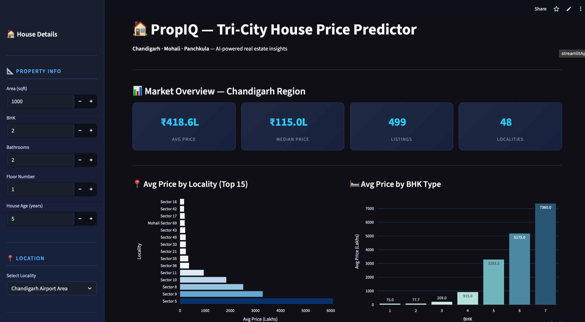
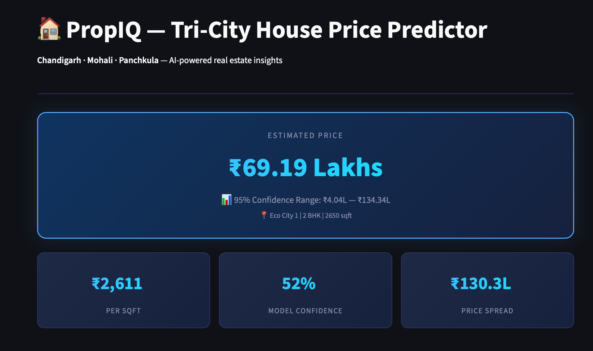

# 🏠 PropIQ — Tri-City House Price Predictor

> AI-powered real estate valuation for Chandigarh, Mohali & Panchkula


---

## 🌐 Live Demo

👉 **[Try PropIQ Live](https://housepricepredictionv1.streamlit.app)**

---

## 📌 What is PropIQ?

PropIQ is an open-source machine learning web application that predicts residential property prices in the **Chandigarh Tri-City region** (Chandigarh, Mohali, Panchkula). It goes beyond a simple price prediction form — it's a complete real estate decision-support tool built for buyers, students, and data enthusiasts.

---

## ✨ Features

| Feature | Description |
|---|---|
| 🎯 **Price Prediction** | Instant price estimate based on area, BHK, locality & more |
| 📊 **Confidence Interval** | 95% price range using all 100 Random Forest trees |
| 🏘️ **Similar Properties** | Top 5 comparable listings from the market |
| 📈 **Market Trends** | Average prices by locality and BHK type |
| 🔄 **What-If Analysis** | See how price changes with area or BHK variations |
| 🏦 **EMI Calculator** | Monthly EMI, total interest & affordability breakdown |

---

## 🖥️ Screenshots

> Home Screen — Market Overview


> Prediction Results


---

## 🛠️ Tech Stack

- **Language:** Python 3.x
- **ML Model:** Random Forest Regressor (scikit-learn)
- **Frontend:** Streamlit
- **Charts:** Plotly
- **Data:** [india-housing-datasets](https://pypi.org/project/india-housing-datasets/)
- **Deployment:** Streamlit Community Cloud

---

## 🚀 Getting Started

### Prerequisites
- Python 3.8 or higher
- Git

### Installation

**1. Clone the repository**
```bash
git clone https://github.com/Priyanshu-6/PropIQ.git
cd PropIQ
```

**2. Create and activate a virtual environment**
```bash
# Create
python -m venv venv

# Activate (Mac/Linux)
source venv/bin/activate

# Activate (Windows)
venv\Scripts\activate
```

**3. Install dependencies**
```bash
pip install -r requirements.txt
```

**4. Train the model**
```bash
python model.py
```
This generates `house_price_model.pkl`, `locality_encoder.pkl`, and `housing_data.csv`.

**5. Run the app**
```bash
streamlit run app.py
```

Open `http://localhost:8501` in your browser.

---

## 📁 Project Structure

```
PropIQ/
├── app.py                  # Streamlit application — UI & all features
├── model.py                # Model training, evaluation & artifact generation
├── requirements.txt        # Python dependencies
├── house_price_model.pkl   # Trained Random Forest model
├── locality_encoder.pkl    # LabelEncoder for locality column
├── housing_data.csv        # Raw dataset with original locality names
├── LICENSE                 # MIT License
└── README.md               # You are here
```

---

## 🤝 Contributing

Contributions are welcome! Please read [CONTRIBUTING.md](CONTRIBUTING.md) before submitting a Pull Request.

**Areas where we'd love help:**
- 🏙️ Adding support for more Indian cities
- 🤖 Better ML models (XGBoost, LightGBM)
- 🎨 UI improvements
- 🐛 Bug fixes

---

## ⚠️ Disclaimer

PropIQ predictions are based on historical data and are intended for informational purposes only. Do not make financial decisions solely based on this tool. Always consult a professional real estate advisor.

---

## 📄 License

This project is licensed under the **MIT License** — see the [LICENSE](LICENSE) file for details.

---

## 👨‍💻 Author

**Priyanshu Rai** — [@Priyanshu-6](https://github.com/Priyanshu-6)

---

<p align="center">Made with ❤️ for the Chandigarh real estate community</p>